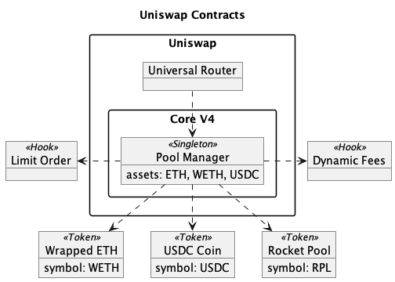
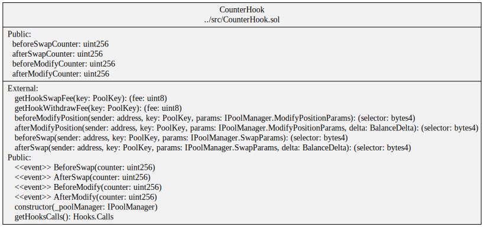
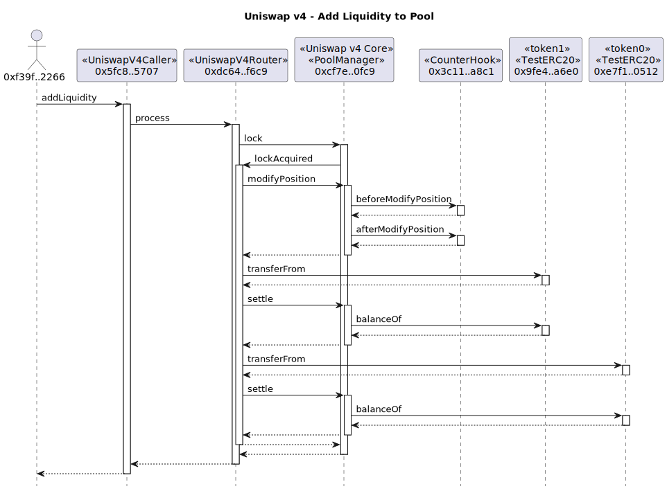
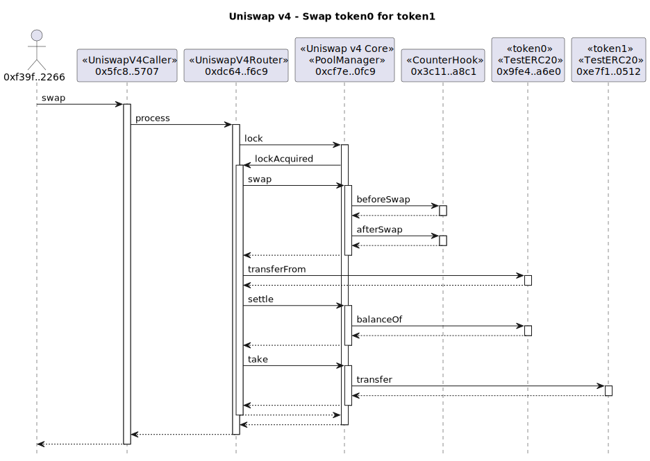
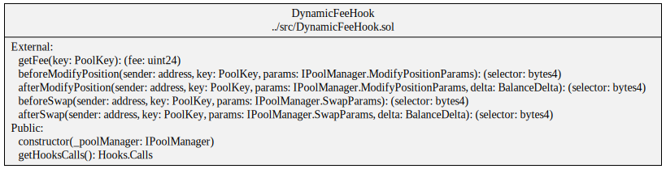
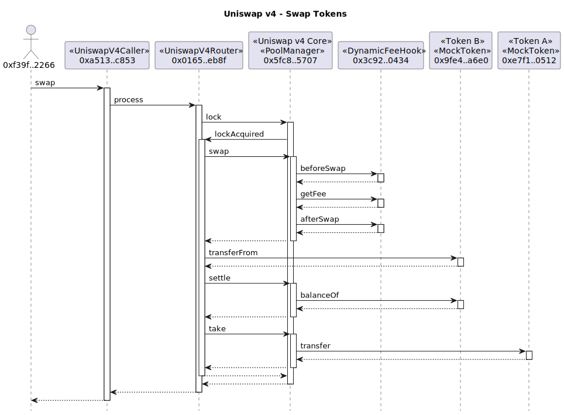

# Shush Swap

Shush Swap is a Uniswap V4 plugin allowing private interactions with a compliant pool.

# Private Swaps

The private swaps hook allows users to deposit ERC-20 tokens into a custodian smart contract along with a commitment used later to facilitate swaps that are verifiably backed and may only be executed once. This allows users to anonymously swap currencies or send any ERC-20 token to another account.

## Implementation

To use the private swaps hook in a conforming V4 pool, users must initially approve the external hooks contract to use their input ERC-20 token. Following, users will invoke the `depositSwapPayment(IERC20 tokenIn, unit256 amount, bytes32 depositCommitment)` which will transfer an `amount` of `tokenIn` to the contract. Attached to the deposit is a private `depositCommitment` which is `poseidon("DEPOSIT", amount, nullifier)`. The nullifier is used by the prover to create proofs that a swap is associate with an existing deposit that has yet to be used. During the deposit, the `depositCommitment` is insert as a leaf in a merkle tree which is associate with the input token.

When a swapper (either the original depositor or anyone with the nullifier) attempts to make a private swap they must create a proof that:
1. They know *a* nullifier (+ `amount` and `tokenIn`) that satisfies the constraint `poseidon("DEPOSIT", amount, nullifier)` is a leaf in the merkle tree for a token (private inputs: `nullifier`, `merklePath`; public inputs: `tokenIn`, `amount`, `merkleRoot`)

Prior to executing the swap, the swapper may call `prepareSwap(address swapper, address tokenIn, uint256 amount, bytes proof)` which will verify the proof and ensure:
1. The `merkleRoot` for the `tokenIn` and `amount` matches the proof's public inputs
2. the swap commitment (`poseidon("SWAP", amount, nullifier)`) does not exist

Following the proof verification, the private swaps contract will store the `swapCommitment` (which is associated with the `tokenIn`) and increase the credit of the `swapper` by the `amount`. By increasing the `swapper`'s credit for the `tokenIn`, it allows the `swapper` to use an `amount` of `tokenIn` during a V4 swap - provided during the `beforeSwap` hook.

## Variant #1: Partial swap amounts

By altering the swap proving system, the private swaps hook can allow a swapper to use an `amount` of `tokenIn` where `amount` is less than or equal to their remaining balance of the initial deposit. The swapper must also specify the `swapNonce` which is a counter that increments per swap using the deposit. When adding an inital deposit to the private swaps contract, the leaf is `poseidon("DEPOSIT", 0, amount, nullifier)`. To achieve this, the contract will store the `depositCommitment` and `amount`.

The swap proof is slightly modified where:
1. The swap commitment checks the swapper know the nullifier, initial deposit amount and swapNonce (where `swapNonce = # of swaps using the deposit`)
2. The current swap amount is less than or equal to the corresponding deposit's amount
3. The proof outputs a newly generated deposit commitment where `depositCommitment = poseidon("DEPOSIT", swapNonce + 1, remainingAmount, nullifier)` and `remainingAmount = initialDepositAmount - swapAmount`

The private swap contract contains an additional input `remainingDepositCommitment` that will be inserted to the deposit tree for the `tokenIn` and may be used later to execute further swaps.

## Variant #2: Swap to stealth address

One extension to the private swaps hook is to allow swappers to execute swaps to a stealth address. This stealth address can be deterministically derived from the depositor's address and their `depositNullifier`. In the `beforeSwap` hook, the private swaps hook will check if a stealth address (an output of the proof) has credited balance and will pull from this balance if so.

## Uniswap v4 Feature Summary

- Lifecycle Hooks: initialize, position, swap and donate
- Hook managed fees
  - swap and/or withdraw
  - static or dynamic
- Swap and withdraw protocol fees
- ERC-1155 accounting of multiple tokens
- Native ETH pools like V1
- Donate liquidity to pools

## Contracts Diagrams

Contract dependencies



## Install

This project uses [Foundry](https://book.getfoundry.sh) to manage dependencies, compile contracts, test contracts and run a local node. See Foundry [installation](https://book.getfoundry.sh/getting-started/installation) for instructions on how to install Foundry which includes `forge` and `anvil`.

```
git clone git@github.com:naddison36/uniswap-v4-hooks.git
cd uniswap-v4-hooks
forge install
forge update v4-periphery
```

## Unit Testing

The following will run the unit tests in [test/CounterScript](./test/CounterScript.sol)

```
forge test -vvv
```

## Counter Hook Example

1. The [CounterHook](src/CounterHook.sol) demonstrates the `beforeModifyPosition`, `afterModifyPosition`, `beforeSwap` and `afterSwap` hooks.
2. The [CounterScript](test/CounterScript.sol) deploys the v4 pool manager, test tokens, counter hook and test routers. It then sets up a pool, adds token liquidity and performs a swap.
3. The [CounterScript](script/CounterScript.sol) script deploys to a local Anvil node and does a swap.



### Local Testing

Because v4 exceeds the bytecode limit of Ethereum and it's _business licensed_, we can only deploy & test hooks on a local node like [Anvil](https://book.getfoundry.sh/anvil/).

The following runs the [script/CounterScript](./script/CounterScript.sol) Forge script against a local Anvil node that:

- Deploys the Uniswap v4 PoolManager
- Uses the `CounterFactory` to deploy a [CounterHook](./src/CounterHook.sol) contract with the correct address prefix.
- Creates a new pool with `CounterHook` as the hook.
- Adds token liquidity to the pool
- Performs a token swap

```bash
# start anvil with a larger code limit
anvil --code-size-limit 30000
```

```bash
# in a new terminal, run the Forge script
export PRIVATE_KEY=0xac0974bec39a17e36ba4a6b4d238ff944bacb478cbed5efcae784d7bf4f2ff80
forge script script/CounterScript.sol \
    --rpc-url http://localhost:8545 \
    --code-size-limit 30000 \
    --broadcast
```

WARNING The above private key for account 0xf39Fd6e51aad88F6F4ce6aB8827279cffFb92266 is only used for Foundry testing. Do not use this known account on mainnet.

```bash
# Get the counter values from the CounterHook
export COUNTER=0x3CD91b522f2a6CB67F378d7fBee767602d5140bB
cast call $COUNTER "beforeSwapCounter()(uint256)" --rpc-url http://localhost:8545
cast call $COUNTER "afterSwapCounter()(uint256)" --rpc-url http://localhost:8545
```

Summary of the modify position calls



Summary of the swap calls



See [here](./docs/README.md#counter-hook) for more detailed transaction traces with call parameters and events.

## My Hook

1. The [MyHook](src/MyHook.sol) contract has empty `beforeInitialize`, `afterInitialize`, `beforeModifyPosition`, `afterModifyPosition`, `beforeSwap`, `afterSwap`, `beforeDonate` and `afterDonate` hooks that can be implemented.
2. The [MyHookScript](script/MyHookScript.sol) script deploys to a local Anvil node and does a swap.

```bash
# start anvil with a larger code limit
anvil --code-size-limit 30000
```

```bash
# in a new terminal, run the Forge script
export PRIVATE_KEY=0xac0974bec39a17e36ba4a6b4d238ff944bacb478cbed5efcae784d7bf4f2ff80
forge script script/MyHookScript.sol \
    --rpc-url http://localhost:8545 \
    --code-size-limit 30000 \
    --broadcast
```

## Dynamic Fee Hook

1. The [DynamicFeeHook](src/DynamicFeeHook.sol) contract has an empty `getFee` function that is used to set the fee for dynamic fee pools.
   It also has empty `beforeModifyPosition`, `afterModifyPosition`, `beforeSwap` and `afterSwap` hooks but they are not required for a dynamic fee hook. They can be removed if not needed.
2. The [DynamicFeeScript](script/DynamicFeeScript.sol) script deploys to a local Anvil node and does a swap. Note the fee in the PoolKey is set with the `DYNAMIC_FEE_FLAG`.

```Solidity
// Derive the key for the new pool
poolKey = PoolKey(
    Currency.wrap(address(token0)), Currency.wrap(address(token1)), FeeLibrary.DYNAMIC_FEE_FLAG, 60, hook
);
// Create the pool in the Uniswap Pool Manager
poolManager.initialize(poolKey, SQRT_RATIO_1_1);
```



Summary of the swap calls



See [here](./docs/README.md#dynamic-fee-hook) for more examples and details.

### Local Testing

```bash
# start anvil with a larger code limit
anvil --code-size-limit 30000
```

The following runs the [DynamicFeeScript](script/DynamicFeeScript.sol) against a local Anvil node

```bash
# in a new terminal, run the Forge script
export PRIVATE_KEY=0xac0974bec39a17e36ba4a6b4d238ff944bacb478cbed5efcae784d7bf4f2ff80
forge script script/DynamicFeeScript.sol \
    --rpc-url http://localhost:8545 \
    --code-size-limit 30000 \
    --broadcast
```

## Contribution

This repository was created from this GitHub project template https://github.com/saucepoint/v4-template. Thanks [@saucepoint](https://twitter.com/saucepoint) for an excellent starting point. This repo has significantly evolved from the starting template.

## Additional resources:

- [Uniswap V3 Development Book](https://uniswapv3book.com/)
- [Uniswap v4 Core](https://github.com/Uniswap/v4-core/blob/main/whitepaper-v4-draft.pdf) whitepaper
- Uniswap [v4-core](https://github.com/uniswap/v4-core) repository
- Uniswap [v4-periphery](https://github.com/uniswap/v4-periphery) repository contains advanced hook implementations that serve as a great reference.
- A curated list of [Uniswap v4 hooks](https://github.com/fewwwww/awesome-uniswap-hooks#awesome-uniswap-v4-hooks)
- [Uniswap v4 Hooks: Create a fully on-chain "take-profit" orders hook on Uniswap v4](https://learnweb3.io/lessons/uniswap-v4-hooks-create-a-fully-on-chain-take-profit-orders-hook-on-uniswap-v4/)
- [SharkTeam's Best Security Practices for UniswapV4 Hooks](https://twitter.com/sharkteamorg/status/1686673161650417664)
- [Research - What bad hooks look like](https://uniswap.notion.site/Research-What-bad-hooks-look-like-b10256c445904111914eb3b01fb4ec53)
